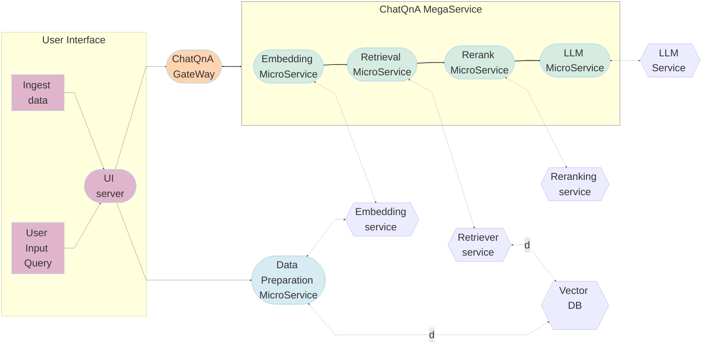

# ChatQnA Application

Chatbots are the most widely adopted use case for leveraging the powerful chat and reasoning capabilities of large language models (LLMs). The retrieval augmented generation (RAG) architecture is quickly becoming the industry standard for chatbots development. It combines the benefits of a knowledge base (via a vector store) and generative models to reduce hallucinations, maintain up-to-date information, and leverage domain-specific knowledge.

RAG bridges the knowledge gap by dynamically fetching relevant information from external sources, ensuring that responses generated remain factual and current. The core of this architecture are vector databases, which are instrumental in enabling efficient and semantic retrieval of information. These databases store data as vectors, allowing RAG to swiftly access the most pertinent documents or data points based on semantic similarity.

# Table of contents

1. [Architecture and Deploy Details](#architecture-and-deploy-details)
2. [Automated Terraform Deployment](#automated-deployment-to-ubuntu-based-systemif-not-using-terraform-using-intel-optimized-cloud-modules-for-ansible)
3. [Automated Deployment to Ubuntu based system](#automated-deployment-to-ubuntu-based-systemif-not-using-terraform-using-intel-optimized-cloud-modules-for-ansible)
4. [Monitoring and Tracing](#monitoring-opea-service-with-prometheus-and-grafana-dashboard)

## Architecture

ChatQnA architecture shows below:


The ChatQnA example is implemented using the component-level microservices defined in [GenAIComps](https://github.com/opea-project/GenAIComps). The flow chart below shows the information flow between different microservices for this example.



This ChatQnA use case performs RAG using LangChain, Redis VectorDB and Text Generation Inference on [Intel Gaudi2](https://www.intel.com/content/www/us/en/products/details/processors/ai-accelerators/gaudi-overview.html) or [Intel Xeon Scalable Processors](https://www.intel.com/content/www/us/en/products/details/processors/xeon.html).
In the below, we provide a table that describes for each microservice component in the ChatQnA architecture, the default configuration of the open source project, hardware, port, and endpoint.

Gaudi default compose.yaml
| MicroService | Open Source Project | HW | Port | Endpoint |
| ------------ | ------------------- | ----- | ---- | -------------------- |
| Embedding | Langchain | Xeon | 6000 | /v1/embeddings |
| Retriever | Langchain, Redis | Xeon | 7000 | /v1/retrieval |
| Reranking | Langchain, TEI | Gaudi | 8000 | /v1/reranking |
| LLM | Langchain, TGI | Gaudi | 9000 | /v1/chat/completions |
| Dataprep | Redis, Langchain | Xeon | 6007 | /v1/dataprep/ingest |

### Required Models

By default, the embedding, reranking and LLM models are set to a default value as listed below:

| Service   | Model                               |
| --------- | ----------------------------------- |
| Embedding | BAAI/bge-base-en-v1.5               |
| Reranking | BAAI/bge-reranker-base              |
| LLM       | meta-llama/Meta-Llama-3-8B-Instruct |

Change the `xxx_MODEL_ID` in `docker_compose/xxx/set_env.sh` for your needs.

For customers with proxy issues, the models from [ModelScope](https://www.modelscope.cn/models) are also supported in ChatQnA. Refer to [this readme](docker_compose/intel/cpu/xeon/README.md) for details.

## 🤖 Automated Terraform Deployment using Intel® Optimized Cloud Modules for **Terraform**

| Cloud Provider       | Intel Architecture                | Intel Optimized Cloud Module for Terraform                                                                                         | Comments                                                             |
| -------------------- | --------------------------------- | ---------------------------------------------------------------------------------------------------------------------------------- | -------------------------------------------------------------------- |
| AWS                  | 4th Gen Intel Xeon with Intel AMX | [AWS Module](https://github.com/intel/terraform-intel-aws-vm/tree/main/examples/gen-ai-xeon-opea-chatqna)                          | Uses meta-llama/Meta-Llama-3-8B-Instruct by default                  |
| AWS Falcon2-11B      | 4th Gen Intel Xeon with Intel AMX | [AWS Module with Falcon11B](https://github.com/intel/terraform-intel-aws-vm/tree/main/examples/gen-ai-xeon-opea-chatqna-falcon11B) | Uses TII Falcon2-11B LLM Model                                       |
| GCP                  | 5th Gen Intel Xeon with Intel AMX | [GCP Module](https://github.com/intel/terraform-intel-gcp-vm/tree/main/examples/gen-ai-xeon-opea-chatqna)                          | Also supports Confidential AI by using Intel® TDX with 4th Gen Xeon |
| Azure                | 5th Gen Intel Xeon with Intel AMX | Work-in-progress                                                                                                                   | Work-in-progress                                                     |
| Intel Tiber AI Cloud | 5th Gen Intel Xeon with Intel AMX | Work-in-progress                                                                                                                   | Work-in-progress                                                     |

## Automated Deployment to Ubuntu based system(if not using Terraform) using Intel® Optimized Cloud Modules for **Ansible**

To deploy to existing Xeon Ubuntu based system, use our Intel Optimized Cloud Modules for Ansible. This is the same Ansible playbook used by Terraform.
Use this if you are not using Terraform and have provisioned your system with another tool or manually including bare metal.
| Operating System | Intel Optimized Cloud Module for Ansible |
|------------------|------------------------------------------|
| Ubuntu 20.04 | [ChatQnA Ansible Module](https://github.com/intel/optimized-cloud-recipes/tree/main/recipes/ai-opea-chatqna-xeon) |
| Ubuntu 22.04 | Work-in-progress |

## Troubleshooting

1. If you get errors like "Access Denied", [validate micro service](https://github.com/opea-project/GenAIExamples/tree/main/ChatQnA/docker_compose/intel/cpu/xeon/README.md#validate-microservices) first. A simple example:

   ```bash
   http_proxy="" curl ${host_ip}:6006/embed -X POST  -d '{"inputs":"What is Deep Learning?"}' -H 'Content-Type: application/json'
   ```

2. (Docker only) If all microservices work well, check the port ${host_ip}:8888, the port may be allocated by other users, you can modify the `compose.yaml`.

3. (Docker only) If you get errors like "The container name is in use", change container name in `compose.yaml`.

## Monitoring OPEA Service with Prometheus and Grafana dashboard

OPEA microservice deployment can easily be monitored through Grafana dashboards in conjunction with Prometheus data collection. Follow the [README](https://github.com/opea-project/GenAIEval/blob/main/evals/benchmark/grafana/README.md) to setup Prometheus and Grafana servers and import dashboards to monitor the OPEA service.


## Tracing Services with OpenTelemetry Tracing and Jaeger

> NOTE: This feature is disabled by default. Please check the Deploy ChatQnA sessions for how to enable this feature with compose.telemetry.yaml file.

OPEA microservice and TGI/TEI serving can easily be traced through Jaeger dashboards in conjunction with OpenTelemetry Tracing feature. Follow the [README](https://github.com/opea-project/GenAIComps/tree/main/comps/cores/telemetry#tracing) to trace additional functions if needed.

Tracing data is exported to http://{EXTERNAL_IP}:4318/v1/traces via Jaeger.
Users could also get the external IP via below command.

```bash
ip route get 8.8.8.8 | grep -oP 'src \K[^ ]+'
```

Access the Jaeger dashboard UI at http://{EXTERNAL_IP}:16686

For TGI serving on Gaudi, users could see different services like opea, TEI and TGI.


Here is a screenshot for one tracing of TGI serving request.


There are also OPEA related tracings. Users could understand the time breakdown of each service request by looking into each opea:schedule operation.


There could be async function such as `llm/MicroService_asyn_generate` and user needs to check the trace of the async function in another operation like
opea:llm_generate_stream.

